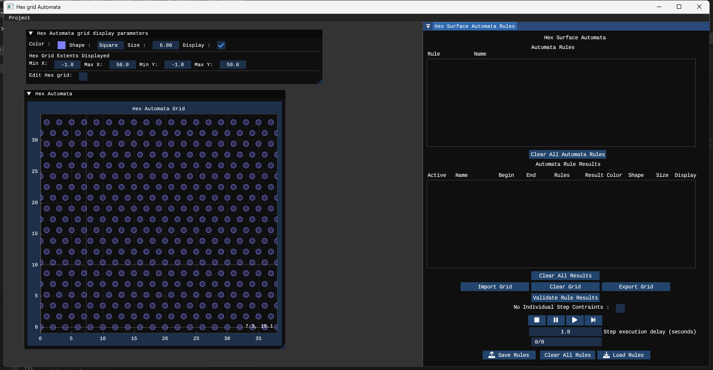
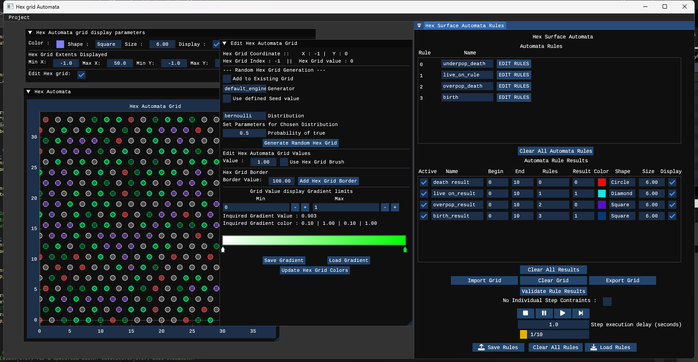

## Hex Grid Automata (HGA)

A PDF version of this readme exists in the Documentation directory of this project with the filename readme.pdf.

## Introduction
Hex grid automata (HGA) that is under the current visual studio project name VW_Automata is an application to perform defined cellular automata rules in a 2D hexagonal grid environment.
This can be considered as a complete and functional first step application that can perform some basic neighbor driven cellular automata and be expanded or forked for possible more complex automata rules and conditions.
The design of the code of this application is such that this will form a basis for a regular 2D Cartesian grid structure and both a 3D cartesian and hexagonal grid structures.

The design incorporates that the user defines rule conditions for the cellular automata as a series of c/c++ like conditional statements that query the neighbours of a grid cell of a current hexagonal grid as well as itself. 
If any of a series of conditions are true, a value to the current processing step of the hexagonal grid, the grid cell is assigned a value according to which set of conditions are met as defined by the user.
A standard cellular automata step procedure.

The application uses ImGui and ImPlot as its major third party dependencies as well the usual dependencies they require and, and is coded in ISO C++20 Standard as a visual studio community project.
All these files are included to insure no breaking of the application code will occur due any updates as has happend in the past while coding or compiling other downloaded projects. 

In future the name of this application will be changed when a suitable name is decided upon.

## Installation:

This project is a Visual Studio 2022 SDK 10 ISO C++ 20 Standard project set up for windows. 

1 : Download the files within the VS_Automata repository into a desired directory location.

2 : Open visual studio 2022 and open the visual studio project VS_Automata.sln file.

3 : Compile and run the code.

4 : An existing binary file should be present in the project directory Bin/x64/Release. If the user does not wish to build the project, this directory can be copied in its entirety to a location of choice and the executable run from there.

## Quick Demonstation

1  : On starting the application the user is presented with a blank screen with a menu list under the Project banner. Left click on this menu option and select New Automata Project. This will open up a dialoge box to specify the dimasions and an initial value for the hex grid that the cellular automata is to be performed within. Accept the default values and select the Create Globa Hex Grid button with the left mouse button to generate a default hex grid. A series of Imgui widgets should then be displayed in the screen as illustrated as in Fig 01

	
	
	Fig 01.

2  : Under the Hex Surface Automata Rules  widget is a button Load Rules. Select it and a dialogue screen to select a file of automata rules should appear and most likely will default to the directory that the application was started in. Navigate to the directory called Rules/Automata. A selection of example rules should appear. Select the rules file called conroy_game_of_life_HGAR.txt to load this set of rules. 	 

3  : Before the rules for this selection can be applied, the rules need to be validated. Select the validate the rules results button. A dialogue to indicate the rules have been validated should appear. Select the OK button to close the dialogue

4  : Under the Hex Automata grid disply parameters widget is a checkbox with the label Edit Hex Grid:. Select it to have a tick mark displayed in the check box, a widget Edit Hex Automata Grid should appear.

5  : Within the Edit Hex Automata Grid widget is a section called Random Hex Grid Generation. Select the drop down combo menu next to the label Distribution and select bernoulli. The display under Set Parameters for Chosen Distribution should change to give an entry of 0.5 nest to a text label of Probability of true. Accept this value and select the button directly under this with the label Generate Random Hex Grid. A random distribution of grid values should now be displayed in the plotted hex grid. 
	
	

6  : Now to perform the cellular automata task upon this defined grid, in the Hex Surface Automata Rules widget are a series of control buttons under the validate the rules results button that look similar to that of a video or audio player. In order left to right are stop, pause, play, and next step. Press the far right button that looks like an arrow head and vertical line to process the first automata step for this grid and defined rule set. The grid display will change to indicate what rules have been applied corresponding to the list of Automata rule results. By selecting the display check box at the end of each rule result the user can turn on and off the rule result display data. This display is useful for debugging automata rules and results.  Deselecting all the displays the user can see the progress of the automata rules applied to the hex grid as it goes through each iteration step. Repeat pressing the next step control button until it stops at step 10, or the automata grid does not change or becomes blank. Upon reaching step 10, the user can reset the automata step process by clicking on the far left control button that looks like a square. This will reset the automata step back to zero and the user can again press the next step button to progress the cellula automata grid to the next iteration or state.

This is the most basic of functionality that is explained for this application. Defining rules and initiating a grid to use those rules will be described in a future user guide publication.

## Dependencies
    These are a list of the current third party dependencies for this project

    glfw
    glew
    ImGui
    imgui-docking
	implot
    tinyfiledialogs

Dependency source header files to be defined where $(ProjectDir) is the project directory where the header files are located

	$(ProjectDir);
	$ProjectDir)Source;
	$(ProjectDir)ThirdParty;
	$(ProjectDir)ThirdParty\ImGui\imgui_docking;
	$(projectDir)ThirdParty\ImGUI\imgui_docking\backends;
	$(projectDir)ThirdParty\ImGUI\implot;
	$(ProjectDir)ThirdParty\glew\include;
	$(ProjectDir)ThirdParty\glew\src;
	$(ProjectDir)ThirdParty\glfw\include;
	$(ProjectDir)ThirdParty\glfw\src;
	$(ProjectDir)ThirdParty\glm-1.0.1;
	$(ProjectDir)ThirdParty\ImGradientHDR\src;

Dependency libs to be defined where $(ProjectDir) is the project directory where the lib files are located

    opengl32.lib

## Source Code

Because this is a working project, within the source code is a lot of debugging code that has largely been commented out.

Much of the code has been written for as easy reading as much as possible to understand what the code does and is for. However some of the code that has been adopted or copied from 3rd parties may follow a different naming convention
